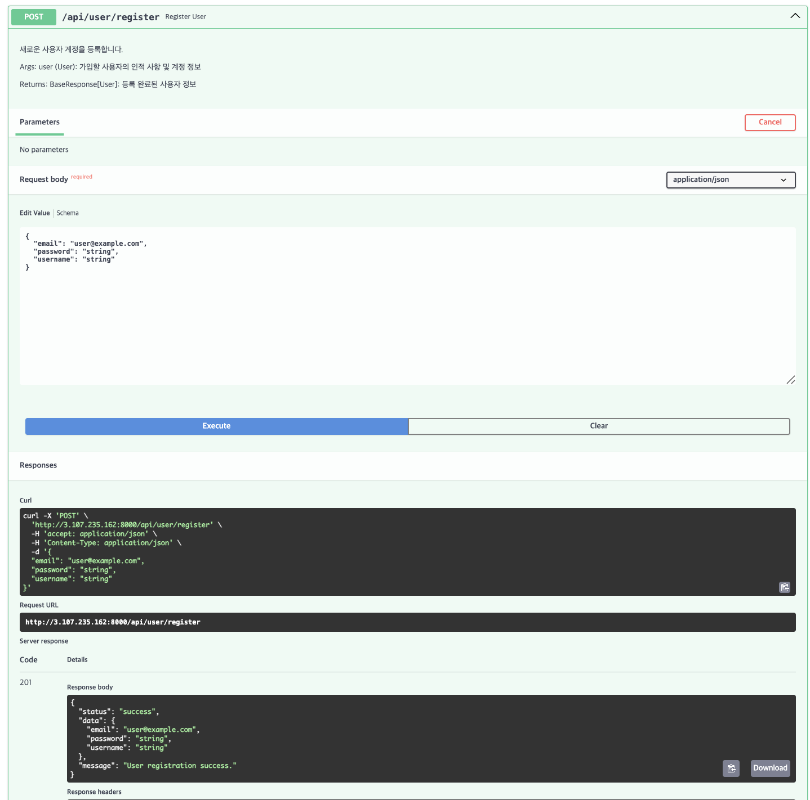
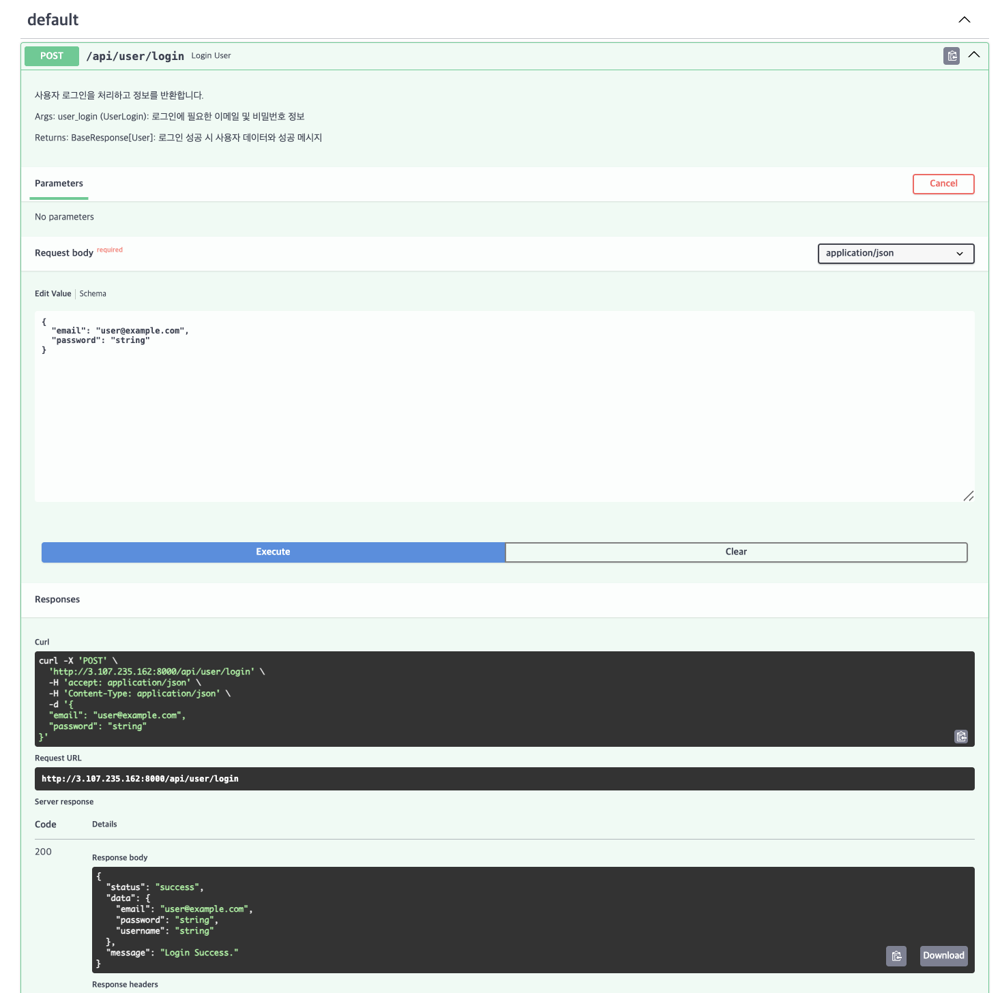
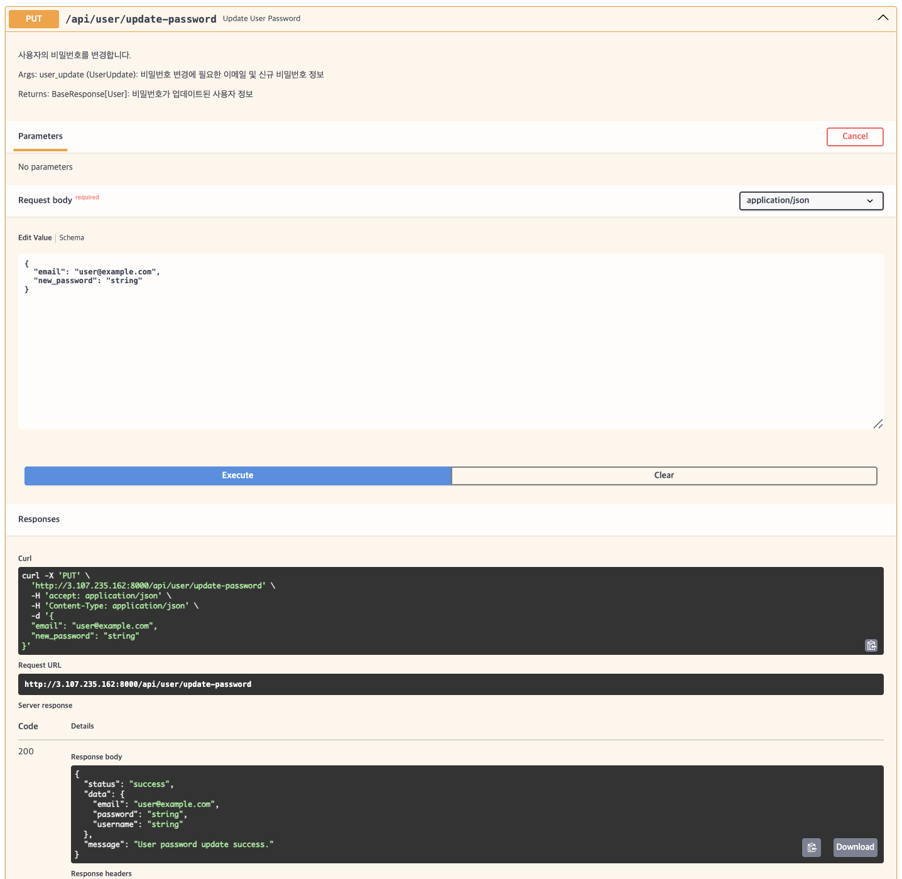
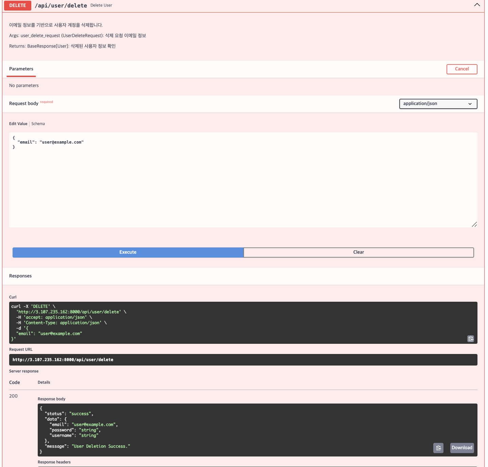
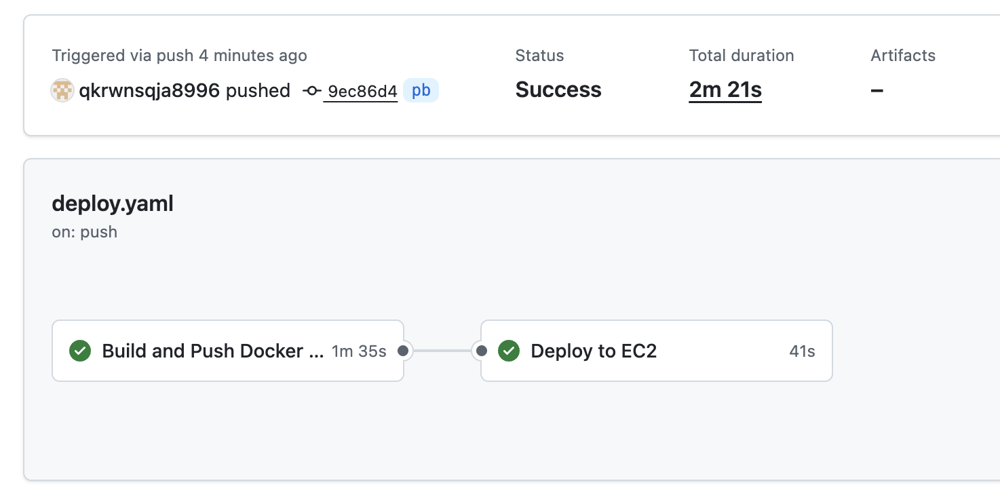

# YBIGTA 1조
YBIGTA 28기 신입 기수 팀 과제 1조입니다.

## 팀 소개

팀원 자기소개
- 김아연: 팀장 / 응용통계학과 22학번/ 02년생 / MBTI: ISFJ
- 임수빈: 팀원 / 첨단컴퓨팅학부 25학번 / 04년생 / MBTI: ISTJ
- 박준범: 팀원 / 천문우주학과 22학번 / 03년생 / MBTI: INTP

## 8회차 과제 (DB, Docker, AWS)
이번 과제는 데이터베이스 구축, 컨테이너화, 그리고 클라우드 기반의 지속적 통합 및 배포(CI/CD)를 하는 것이 목표임.

MySQL과 MongoDB를 활용해서 DB환경을 구축한 뒤, Docker를 활용해  AWS EC2에서 컨테이너를 실행한 후 Github Action을 통해 CI/CD를 자동화를 실행함

## 과제 내용
### 1. Docker Hub 주소
Docker Hub 주소 : [https://hub.docker.com/repository/docker/qkrwnsqja0220/ybigta-project] 

### 2. AIP 실행 결과 (AWS EC2 배포 환경)
> 모든 API는 AWS EC2 인스턴스에 배포된 Swagger UI 환경에 테스트되었습니다.

#### 유저 관리 API (MySQL 연동)
| 기능 | 실행 결과 (스크린샷) |
| :--- | :--- |
| **회원가입 (Register)** |  |
| **로그인 (Login)** |  |
| **비밀번호 변경 (Update)** |  |
| **회원 탈퇴 (Delete)** | 

#### 데이터 전처리 API (MongoDB 연동)
 | 기능 | 실행 결과 (스크린샷) |
 | :--- | :--- |
 | **전처리 실행 결과** |  |

 #### CI/CD 자동화 성공 인증
| 기능 | 실행 결과 (스크린샷) |
| :--- | :--- |
| **GitHub Action Status** |  |

## 추가
프로젝트를 진행하며 깨달은 점, 마주쳤던 오류를 해결한 경험을 README에 작성하고
이와 관련된 개념 정리 

### 프로젝트를 진행하며 깨달은 점
이번 프로젝트를 통해 로컬 환경의 애플리케이션이 실제 클라우드 인프라(AWS)와 연동되어 배포되는 전체 라이프사이클을 직접 경험할 수 있었음.

특히, 그동안 추상적으로만 알고 있었던 DB 구축 및 외부 서버 연결 프로세스를 하나씩 해결하며 백엔드 아키텍처의 큰 틀을 잡을 수 있었던 점이 매우 뜻 깊었음. 단순히 기능을 구현하는 것을 넘어, Docker와 GitHub Actions를 활용한 CI/CD 파이프라인을 구축해 봄으로써 현대적인 개발 환경에서의 자동화가 생산성에 얼마나 기여하는지 몸소 깨닫는 계기가 되었음.

### 오류 사례1 Git Push 거절 (Non-fast-forward)
- 오류 원인 : yaml 파일을 push하려고 하였으나, 로컬과 원격 저장소의 이력이 달라 push가 거절됨.
- 해결 : git pull origin pb --no--rebase 명령어를 통해 원격의 최신 변경 사항을 로컬과 병합한 후 다시 push 하여 해결
- 배운 점 : 
협업을 할 경우 브랜치 관리를 잘 해야한다는 점을 몸소 체험함. 또한 최신 코드 동기화의 중요성을 깨달을 수 있었음.
코드 동기화의 경우 신입 교육 세션 git 발제 때 언급을 했던 부분이었는데, 그 때는 쉽게 생각하고 넘어갔지만 실제로 로컬과 원격 저장소의 이력이 달라 push가 거절되니 그 중요성을 한 번 더 깨닫게 되었음.

