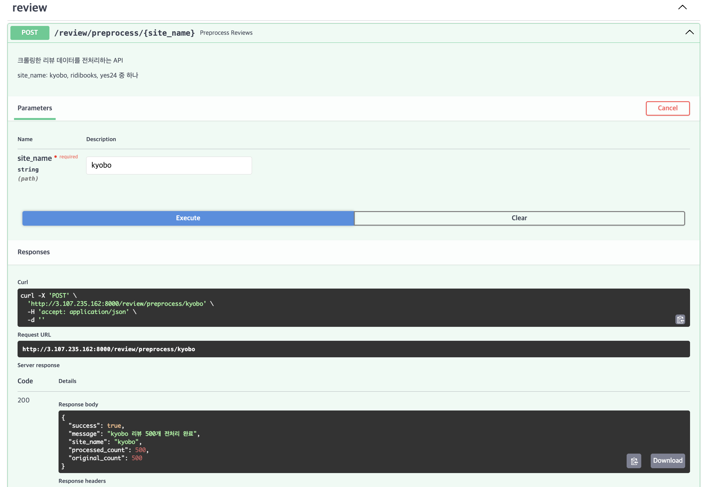

# YBIGTA 1조
YBIGTA 28기 신입 기수 팀 과제 1조입니다.

## 팀 소개

팀원 자기소개
- 김아연: 팀장 / 응용통계학과 22학번/ 02년생 / MBTI: ISFJ
- 임수빈: 팀원 / 첨단컴퓨팅학부 25학번 / 04년생 / MBTI: ISTJ
- 박준범: 팀원 / 천문우주학과 22학번 / 03년생 / MBTI: INTP

## 과제 이미지 첨부
1. branch_protection.png


2. push_rejected.png


3. review_and_merged.png


----------
## Web, Crawling, EDA & FE 과제 실행 방법
1️⃣ Web 실행

    python -m app.main

2️⃣ 크롤링 
각 리뷰 사이트의 데이터를 수집하기 위해 다음 명령어를 실행한다.

    python -m review_analysis.crawling.main

실행 결과
database/ 디렉토리에 사이트별 리뷰 데이터가 CSV 파일로 저장된다.

- 파일명 형식:reviews_{site_name}.csv

3️⃣ 전처리 및 Feature Engineering 
크롤링된 리뷰 데이터에 대해 전처리 및 파생 변수 생성을 수행한다.

    python -m review_analysis.preprocessing.main

실행 결과
각 사이트별 전처리 완료 데이터가 database/ 디렉토리에 저장된다.

- 파일명 형식: preprocessed_reviews_{site_name}.csv

4️⃣ 탐색적 데이터 분석 
EDA 코드는 따로 첨부된 것이 없으며 결과 위치는 다음과 같다.

- 결과 위치: review_analysis/plots/


# 크롤링 / EDA & Feature Engineering / 시각화 과제

## 각 사이트별 소개
### 1️⃣ Ridibooks 리디북스
1. 데이터 소개 
- 사이트: https://ridibooks.com/books/1648000309
- 데이터 수집 대상: 달러구트 꿈 백화점 1
- 크롤링 된 데이터는 csv 파일로 database 내 reviews_ridibooks.csv로 저장되어 있다. 데이터는 총 651개로 각 리뷰 데이터 별로 별점, 리뷰 작성일, 리뷰 텍스트 순으로 저장되어있다.

2. 실행 방법

       python -m review_analysis.crawling.ridibooks_crawler

### 2️⃣ Kyobo 교보문고
1. 데이터 소개
- 사이트: https://product.kyobobook.co.kr/detail/S000001835614
- 데이터 수집 대상: 달러구트 꿈 백화점 1
- 크롤링 된 데이터는 csv 파일로 database 내 reviews_kyobo.csv로 저장되어 있다. 데이터는 총 500개로 각 리뷰 데이터 별로 별점(rating), 리뷰 작성일(date), 리뷰 텍스트(content) 순으로 저장되어 있다.
- rating의 경우 클로버 기준으로 진행이 되었고, html을 살펴보면 filled-stars와 empty-stars가 모두 나와있어 크롤링할 때 width를 기준으로 rating을 취하는 방식을 활용했다.

2. 실행 방법
   
       python -m review_analysis.crawling.kyobo_crawler

### 3️⃣ Yes24 
1. 데이터 소개
- 사이트: https://www.yes24.com/product/goods/91065309
- 데이터 수집 대상: 달러구트 꿈 백화점 1 
- 크롤링 된 데이터는 csv 파일로 database 내 reviews_yes24.csv로 저장되어 있다. 데이터는 총 1200개의 구매 한줄평이다. 각 리뷰 데이터 별로 별점(rating), 리뷰 작성일(date), 리뷰 텍스트(content) 순으로 저장되어있다.

2. 실행 방법
   
       python -m review_analysis.crawling.yes24_crawler

## 전처리/FE 설명
### 1️⃣ Ridibooks 리디북스
RidiBooks 리뷰 데이터에 대해 다음과 같은 전처리 및 feature engineering 과정을 수행하였다.
- 결측치 확인 및 처리: rating, date, content 컬럼을 생성하고 이를 기준으로 결측치 여부를 확인하였다. 결측치는 존재하지 않아 모든 데이터가 분석에 활용되었다.
- 별점 이상치 확인: 별점은 사이트에 있는 범위대로 1-5점을 정상값으로 정의하였다. 확인 결과, 해당 범위를 벗어나는 별점은 존재하지 않았다.
- 날짜 전처리 및 이상치 확인: 리뷰 작성일(date)을 datetime 타입으로 변환하였다. 전자책 발매일(2020-04-21) 이전 리뷰를 날짜 이상치로 간주하였고, 확인 결과 발매일 이전에 작성된 리뷰는 존재하지 않았다.
- 리뷰 길이 이상치 확인: 리뷰의 문자 수(content_len)를 기준으로 10자 미만의 지나치게 짧은 리뷰를 이상치로 정의하여 확인한 결과, 해당 기준에 해당하는 리뷰는 존재하지 않았다.
- 리뷰 텍스트 전처리는 다음과 같이 진행하였다
이모지 제거
반복 문자 정규화 (예: ㅋㅋㅋㅋ → ㅋㅋ)
한글/영문/숫자를 제외한 특수문자 제거 
공백 정리
형태소 분석 및 토큰화 후 명사, 동사, 형용사, 숫자만 추출
리뷰를 보고 의미가 적다고 생각되는 불용어를 임의로 정리한 후 제거
위 과정을 통해 전처리된 리뷰는 content_preprocess 컬럼에 추가하였다. 
예시는 다음과 같다: 
원래 리뷰: 간결하고 군더더기 없는 문체에 독특한 세계관이 개인의 특색과 세심한 이야기를 묘사하고 있다. 마치 지브리의 어른용 만화영화를 한편 보는듯한 묘사들이 즐겁다. 깊이잇지만 가볍고 때론 유머러스한 오랜만에 유쾌하게 잘 만든 작품을 만난거 같다.
전처리 후: 간결하다 군더더기 문체 독특하다 세계관 개인 특색 세심 묘사 마치 지브리 어르다 만화영화 한편 묘사 즐겁다 깊이 잇다 가볍다 때론 유머러스하다 유쾌하다 만들다 작품 만나다
- 파생 변수
리뷰 길이 관련 변수
count_word_count: 리뷰 단어 수

날짜 기반 파생 변수
year: 리뷰 작성 연도
month: 리뷰 작성 월

감정 레이블 생성
별점 기준 감정 분류
  - 1-2점: Negative
  - 3점: Neutral
  - 4-5점: Positive

위에서 생성한 파생 변수들은 이후 탐색적 데이터 분석(EDA) 및 플랫폼 간 비교 분석에 활용하였다.

- 텍스트 벡터화
전처리된 리뷰 텍스트(content_preprocess)를 기반으로 Bag-of-Words(BOW) 벡터를 생성하였다.
출현 빈도가 높은 상위 30개 키워드를 텍스트 특징으로 선정하여 컬럼으로 생성하였다.

### 2️⃣ Kyobo 교보문고
교보문고 리뷰 데이터에 대해 다음과 같은 전처리 및 feature engineering 과정을 수행하였다.
- 결측치 확인 및 처리: rating, date, content 컬럼을 생성하고 이를 기준으로 결측치 여부를 확인하였다. 필수 컬럼에 결측치가 존재하는 행은 제거하여 분석 데이터의 무결성을 확보하였다.
- 결측치 확인 및 처리: rating, date, content 컬럼을 생성하고 이를 기준으로 결측치 여부를 확인하였다. 필수 컬럼에 결측치가 존재하는 행은 제거하여 분석 데이터의 무결성을 확보하였다.
- 날짜 전처리: 리뷰 작성일(date)을 datetime 타입으로 변환하여 시계열 분석이 가능하도록 처리하였다.
- 리뷰 길이 전처리: 리뷰의 길이(text_len)가 2자 미만인 지나치게 짧은 리뷰는 유의미한 정보를 담고 있지 않다고 판단하여 이상치로 정의하고 제거하였다.
- 리뷰 텍스트 전처리는 아래의 5가지 전처리를 진행했다.
    - 한글, 영문, 숫자를 제외한 특수문자 제거 (정규표현식 활용)
    - 다중 공백 등 공백 정리
    - 형태소 분석(Okt) 및 토큰화 후 명사, 동사, 형용사, 부사 추출
    - 분석에 의미가 적은 불용어(예: '것', '수', '하다', '있다' 등) 및 1글자 단어 제거
위 과정을 통해 추출된 핵심 키워드는 keywords 컬럼에 저장하였다.
- 파생 변수 생성: 
    - 리뷰 길이 관련 변수 text_len 을 생성했다.
    - 날짜 기반 파생변수 year, month, season(3-5월 봄, 6-8월 여름, 9-11월 가을, 12-2월 겨울)를 생성했다.
- 감정 레이블 생성
    - 별점 기준 감정 분류를 진행했다.
        - 1-2점: Negative
        - 3점: Neutral
        - 4-5점: Positive
- 텍스트 벡터화: 전처리된 키워드(keywords)를 기반으로 TF-IDF (Term Frequency-Inverse Document Frequency) 벡터화를 수행하여 텍스트의 중요도를 반영한 특징을 추출하였다.

### 3️⃣ Yes24 
Yes24 리뷰 데이터에 대해 다음과 같은 전처리 및 feature engineering 과정을 수행하였다.
- 결측치 확인 및 처리: rating, date, content 컬럼을 생성하고 이를 기준으로 결측치 여부를 확인하였다. 결측치는 존재하지 않아 모든 데이터가 분석에 활용되었다.
- 별점 이상치 확인: 별점은 사이트 범위인 1-5점을 수치형으로 변환하였다. 확인 결과, 해당 범위를 벗어나는 별점은 존재하지 않았다.
- 날짜 전처리 및 이상치 확인: 리뷰 작성일(date)을 datetime 타입으로 변환하였다. 데이터 분석에 오류를 줄 수 있는 날짜 포맷은 변환 과정에서 처리(Coerce)하여 정제하였다.
- 리뷰 길이 이상치 확인: 한줄평 특성상 텍스트 길이가 짧은 편이나, 분석이 불가능할 정도로 짧은 무의미한 데이터는 발견되지 않아 별도의 제거 없이 진행하였다.
- 리뷰 텍스트 전처리는 다음과 같이 진행하였다
이모지 제거
반복 문자 정규화 (예: ㅋㅋㅋㅋ → ㅋㅋ)
한글/영문/숫자를 제외한 특수문자 제거
공백 정리
형태소 분석(Okt) 및 토큰화 후 명사, 동사, 형용사, 숫자만 추출
'예스24', '구매', '책', '읽다' 등 리뷰 의미 분석에 영향이 적은 불용어를 정의하여 제거
위 과정을 통해 전처리된 리뷰는 content_preprocess 컬럼에 추가하였다.
예시는 다음과 같다
원래 리뷰: 책 표지가 너무 예뻐서 홀린듯이 샀는데 내용도 너무 따뜻하고 좋네요.. 다들 꼭 읽어보시길 추천합니다 ㅠㅠ 힐링 그 자체!!
-> 전처리 후: 표지 예쁘다 홀리다 사다 내용 따뜻하다 좋다 다들 추천하다 힐링 자체
- 파생 변수
리뷰 길이 관련 변수
count_word_count: 리뷰 단어 수
content_len: 리뷰 글자 수

날짜 기반 파생 변수
year: 리뷰 작성 연도
month: 리뷰 작성 월
weekday: 리뷰 작성 요일(0:월요일 - 6:일요일)

감정 레이블 생성
sentiment: 별점 기준 감정 분류 - 1~2점: negative/3점: neutral/4~5점: positive

위에서 생성한 파생 변수들은 이후 탐색적 데이터 분석(EDA) 및 플랫폼 간 비교 분석에 활용하였다.

- 텍스트 벡터화
전처리된 리뷰 텍스트(content_preprocess)를 기반으로 Bag-of-Words(BOW) 벡터를 생성하였다.
출현 빈도가 높은 상위 30개 키워드를 텍스트 특징으로 선정하여 컬럼으로 생성하였다.

## EDA
### 1️⃣ Ridibooks 리디북스
1. 별점 분석

별점 분포


- 전체 리뷰의 별점 분포를 확인한 결과, 5점 리뷰가 약 500개로 가장 높은 비중을 차지하였으며, 그 다음으로 4점 리뷰가 약 100개 수준으로 나타났다.
대부분의 리뷰가 4~5점 구간에 집중되어 있어, 전반적으로 해당 작품에 대한 독자 평가가 매우 긍정적인 경향을 보이고 있음을 확인할 수 있다.

별점 이상치 분포


- Box plot을 통해 별점의 분포를 살펴본 결과, 별점은 1-5점 범위 내에서 정상적으로 분포하고 있었다.
대부분의 값은 4-5점 구간에 밀집되어 있으며, 소수의 1-2점 리뷰가 상대적으로 낮은 값의 이상치로 관찰되는 것을 box plot을 통해서도 알 수 있었다.

2. 리뷰 작성 시점 분석


연도별 리뷰 수
- 연도별 리뷰 수를 확인 해본 결과, 책이 나온 2020년에 가장 많은 리뷰 수를 보였으며 해가 지날수록 감소하는 경향을 보였다. 

3. 리뷰 길이 분석
   


리뷰 단어 수 분포
- 히스토그램을 통해 전체 리뷰의 단어 수 분포를 확인하였다. 대부분의 리뷰는 10-20단어 내외의 비교적 짧은 길이를 가지며, 단어 수가 증가할수록 빈도가 급격히 감소하는 우측 꼬리가 긴 right-skewed 분포를 보였다.

4. 감정 분석 분포
   


positive (4-5점) 리뷰가 전체의 대부분을 차지하고 있으며, negative(1~2점)와 neutral(3점)리뷰는 상대적으로 매우 적은 비중을 보였다.
이는 앞서 살펴본 별점 분포 결과와 일관된 양상으로, 4-5점 리뷰가 다수를 차지했던 점이 감정 분포에서도 그대로 반영된 것을 확인할 수 있다. 


5. 텍스트 기반 분석

Bag-of-Words 키워드 분석


전처리된 리뷰 텍스트를 기반으로 Bag-of-Words(BOW) 분석을 수행한 결과, 좋다, 재밌다, 재미있다, 따뜻하다, 동화, 읽히다 등의 긍정적 감성을 나타내는 키워드가 상위에 빈번하게 등장하였다.
이는 별점 및 감정 분포에서 확인한 긍정적인 평가 경향과도 어느정도 일관된 결과로, 작품이 재미·감동·따뜻함과 같은 요소로 독자들에게 인식되고 있음을 보여준다.

워드클라우드


워드클라우드를 통해 전체 리뷰 텍스트의 주요 키워드를 시각화한 결과, 앞서 수행한 분석과 유사하게 재밌다, 동화, 잔잔하다, 꿈, 따뜻하다 등의 단어가 두드러지게 나타나는 것을 알 수 있다. 

### 2️⃣ Kyobo 교보문고


1. 별점 분석
- 별점 분포
    - 전체 리뷰의 별점 분포를 확인한 결과, 최고 평점인 4점(최고예요) 리뷰가 압도적으로 높은 비중을 차지하고 있으며, 그 다음으로 3점(좋아요) 리뷰가 뒤를 이었다. 1~2점의 부정적 평가는 극히 드물게 나타났다.
    - 대부분의 독자가 해당 도서에 대해 매우 높은 만족도를 보이고 있으며, 전반적인 평가가 '호평' 위주로 형성되어 있음을 확인할 수 있다.

- 별점 이상치 분포
    - Box plot을 통해 별점 분포를 살펴본 결과, 데이터의 중심이 상위권(3-4점)에 확연히 치우쳐져 있음을 확인하였다.
    - 대부분의 데이터가 4점에 밀집해 있어 별도의 박스(Box) 형태가 거의 보이지 않을 정도이며, 1~2점 대의 리뷰들이 하위 이상치(Outlier)로 관찰되었다. 이는 대다수의 독자가 작품을 긍정적으로 평가했음을 통계적으로 뒷받침한다.

- 월별 별점 추이
    - (월별 별점 평균선 그래프가 있다면) 출시 초기부터 현재까지 꾸준히 높은 평점을 유지하고 있으며, 특정 시점에 평점이 급락하는 등의 특이 동향은 발견되지 않았다.

2. 리뷰 작성 시점 분석


- 연도별 리뷰 수
    - 연도별 리뷰 추이를 확인한 결과, 도서가 출간되고 베스트셀러로 화제가 되었던 2020년과 2021년에 리뷰가 폭발적으로 집중되었다. 이후 시간이 지남에 따라 리뷰 작성 빈도는 자연스럽게 하락 안정화되는 우하향 추세를 보였다.

3. 감정 분석 분포
   


- 감정 분포
    - 별점을 기준으로 분류한 감정 분포(Positive/Neutral/Negative)를 분석한 결과, Positive(긍정) 리뷰가 전체의 대다수를 차지하였다.
    - Neutral(중립)과 Negative(부정) 리뷰는 상대적으로 매우 적은 비중을 보였다. 이는 앞서 살펴본 별점 분포와 일관된 결과로, 독자들이 느끼는 작품의 정서적 만족도가 매우 높음을 시사한다.

4. 텍스트 기반 분석
   


- 키워드 빈도 분석
    - 전처리된 리뷰 텍스트에서 상위 빈출 키워드를 분석한 결과, '재미', '좋음', '감동', '따뜻함', '위로' 등의 감성적 키워드가 최상위권에 등장하였다.
    - 특히 '술술', '몰입감', '가독성'과 같은 키워드도 상위에 랭크되었는데, 이는 작품의 내용적 측면(재미/감동)뿐만 아니라 가독성 측면에서도 독자들에게 긍정적인 평가를 받고 있음을 보여준다.
- 워드 클라우드
    - 워드클라우드를 통해 전체 리뷰의 핵심 단어를 시각화한 결과, '재미', '따뜻함', '추천', '힐링' 등의 단어가 가장 크게 나타났다.

### 3️⃣ Yes24
기본 분포 및 이상치 확인


1. 별점 분석
   


- 별점 분포: 5점 리뷰가 약 900개 이상으로 전체의 70% 이상을 차지하며 압도적인 긍정 평가를 보였다. 4점 리뷰가 그 뒤를 이었으며, 1~3점 대의 리뷰는 극히 드물게 나타났다.
  
2. 리뷰 작성 시점 분석
   


- 연도별/월별 리뷰 수 추이: 리디북스(2020년 최다)와 달리 2021년에 700건이 넘는 가장 많은 리뷰가 작성되었다. 월별 추이를 보면 2020년 하반기부터 급증하여 2021년 초에 정점(월 175건 이상)을 찍고, 2022년부터는 월 10건 미만으로 유지되는 양상을 보인다.
  
3. 리뷰 길이 분석
히스토그램을 통해 리뷰 텍스트 길이 분포를 확인하였다. '한줄평'이라는 플랫폼 특성에 맞게 대부분의 리뷰가 1~2문장 내외, 10단어 미만의 매우 짧은 단문으로 구성되어 있다. 길이가 길어질수록 빈도가 급격히 감소하는 전형적인 Right-skewed(우측 꼬리가 긴) 분포를 보인다

4. 감정 분석 분포
   


- 감정 분포
    - 별점을 기준으로 분류한 감정 분포(Positive/Neutral/Negative)를 분석한 결과, Positive(긍정) 리뷰가 전체의 대다수를 차지하였다.
    - Neutral(중립)과 Negative(부정) 리뷰는 상대적으로 매우 적은 비중을 보였다. 이는 앞서 살펴본 별점 분포와 일관된 결과로, 독자들이 느끼는 작품의 정서적 만족도가 매우 높음을 시사한다.
      
5. 텍스트 기반 분석
   


- 키워드 빈도 분석(Bag-of-Words)
    - 전처리된 리뷰 텍스트에서 상위 빈출 키워드를 분석한 결과, '재미있다', '좋다', '꿈' , '추천' 등의 작품의 재미에 대한 직관적인 호평이 주를 이뤘다.
- 워드 클라우드
    - 워드클라우드를 통해 전체 리뷰의 핵심 단어를 시각화한 결과, '재밌다', '추천', '좋다', '꿈' 등의 단어가 가장 크게 나타났다.

## 비교분석
### 텍스트 분석 - 감정별 주요 키워드 비교

RIDIBOOKS


YES24


KYOBO


COMPARISON


#### 1. 부정 평가 
교보문고는 부정적인 키워드가 대체로 없었던 반면, YES24와 리디북스는 부정적인 평이 존재했다. 

YES24의 주요 부정 키워드는 주로 "아깝다", "그냥 그렇다", "왜 베스트셀러인지"로 대체로 책의 내용에 비해 과대 평가가 된 것 같다는 내용이 우세하다.
반면 리디북스는 "지루하다"라는 평이 우세하며, 대체로 작품의 전개 방식에 있어서의 부정적인 리뷰가 많았다. 

#### 2. 긍정 평가
긍정 평가에 있어서는 교보문고와 YES24/리디북스로 평가의 결이 달랐다.

교보문고의 경우 주요 긍정 키워드가 "따뜻함", "힐링", "몰입감"으로 책의 내용보다는 책을 읽으면서 느낀 감정에 치우쳐진 리뷰가 주를 이루었다.
반면, YES24와 리디북스는 "재밌다", "꿈" 등  책의 소재와 책의 내용 자체에 대한 감상을 주로 간결하게 나타낸 리뷰가 주를 이루었다.

* 사이트별 리뷰 길이는 교보문고(0-800자) > YES24 (0-50자의 한 줄평) > 리디북스 (대체로 10단어 미만)이다. 이 결과와 함께 위의 비교 분석 내용을 살펴보면, 대체로 길게 리뷰를 작성하는 경향성이 있을 수록 책을 읽으면서 느낀 독자들의 감정을 길게 나열하는 형식을 보인다는 것을 알 수 있다.

## 시계열 분석 - 월별 리뷰 수 추이 비교

RIDIBOOKS


YES24


KYOBO


COMPARISON


#### 1. 월별 리뷰 수 추이
리디북스: 전자책 발매일인 2020년 4월 직후에 가장 많은 리뷰가 발생했다. 종이책이 출간되어 베스트셀러가 되기 전, 전자책 이용자들이 유행을 가장 먼저 감지하고 반응한 시발점 역할을 했다.

교보문고: 2020년 하반기부터 반응이 나타났으며, 특이하게 2023년에 리뷰가 다시 급증(95건)하는 현상을 보였다. 이는 특정 에디션 발매나 오프라인 매대 프로모션 등의 영향으로, 시간이 지난 후에도 꾸준히 판매되는 스테디셀러의 양상을 보인다.

YES24: 2021년에 리뷰 수가 700건 이상 폭발적으로 증가했다. 리디북스와 교보문고보다 초기 반응이 늦은 편이지만, 해당 도서가 대중적인 베스트셀러 궤도에 올랐을 때 가장 많은 일반 독자가 유입된 곳은 YES24였다.

전반적으로 2020년과 2021년에 걸쳐서 책의 구매와 그에 따른 리뷰가 많았고, 그 이후 점차 판매량 자체가 감소했다는 점을 알 수 있다.
2020~2021년의 폭발적인 성장기를 거쳐, 현재는 세 서점 모두 판매량이 하향 안정화되는 전형적인 제품 수명 주기(Product Lifecycle)를 따르고 있다.

#### 2. 월별 리뷰 단어 수 추이

리디북스: 리디북스는 전자책이 정식 발매된 2020년 4월부터 리뷰 데이터가 집계되었다. 가장 눈에 띄는 점은 발매 직후인 4월에 평균 리뷰 길이가 가장 길게 나타났다는 점이다. 이는 종이책 발매 전, 전자책으로 신작을 가장 먼저 접한 독자들의 관여도가 반영된 결과이다.

YES24: YES24는 작품이 대중적인 베스트셀러로 자리 잡은 이후, 리뷰의 길이가 평균 10-20단어 수준에서 안정화되는 경향을 보였다. 시간이 지날수록 리뷰 길이가 짧아지는 것은, 작품에 대한 구체적인 분석보다는 "재미있다", "추천한다" 등 간단한 구매 결정 요인 위주의 리뷰가 늘어났기 때문이다. 이는 일반 대중 독자가 유입되었음을 시사한다.

교보문고: 예외적으로 교보문고는 시기나 유행의 흐름과 무관하게 긴 호흡의 리뷰가 꾸준히 유지되었다. 이는 베스트셀러 여부와 관계없이 정성스러운 서평을 남기는 교보문고 고유의 플랫폼 분위기가 반영된 것으로 판단된다.

## 8회차 과제 (DB, Docker, AWS)
이번 과제는 데이터베이스 구축, 컨테이너화, 그리고 클라우드 기반의 지속적 통합 및 배포(CI/CD)를 하는 것이 목표임.

MySQL과 MongoDB를 활용해서 DB환경을 구축한 뒤, Docker를 활용해  AWS EC2에서 컨테이너를 실행한 후 Github Action을 통해 CI/CD를 자동화를 실행함


## 과제 내용
### 1. Docker Hub 주소
Docker Hub 주소 : [https://hub.docker.com/repository/docker/qkrwnsqja0220/ybigta-project] 

### 2. AIP 실행 결과 (AWS EC2 배포 환경)
> 모든 API는 AWS EC2 인스턴스에 배포된 Swagger UI 환경에 테스트되었습니다.

#### 유저 관리 API (MySQL 연동)
| 기능 | 실행 결과 (스크린샷) |
| :--- | :--- |
| **회원가입 (Register)** |  |
| **로그인 (Login)** |  |
| **비밀번호 변경 (Update)** |  |
| **회원 탈퇴 (Delete)** | 

#### 데이터 전처리 API (MongoDB 연동)
 | 기능 | 실행 결과 (스크린샷) |
 | :--- | :--- |
 | **전처리 실행 결과** |  |

 #### CI/CD 자동화 성공 인증
| 기능 | 실행 결과 (스크린샷) |
| :--- | :--- |
| **GitHub Action Status** |  |


## 추가
프로젝트를 진행하며 깨달은 점, 마주쳤던 오류를 해결한 경험을 README에 작성하고
이와 관련된 개념 정리 

### 프로젝트를 진행하며 깨달은 점
이번 프로젝트를 통해 로컬 환경의 애플리케이션이 실제 클라우드 인프라(AWS)와 연동되어 배포되는 전체 라이프사이클을 직접 경험할 수 있었음.

특히, 그동안 추상적으로만 알고 있었던 DB 구축 및 외부 서버 연결 프로세스를 하나씩 해결하며 백엔드 아키텍처의 큰 틀을 잡을 수 있었던 점이 매우 뜻 깊었음. 단순히 기능을 구현하는 것을 넘어, Docker와 GitHub Actions를 활용한 CI/CD 파이프라인을 구축해 봄으로써 현대적인 개발 환경에서의 자동화가 생산성에 얼마나 기여하는지 몸소 깨닫는 계기가 되었음.


### 오류 사례1 Git Push 거절 (Non-fast-forward)
- 오류 원인 : yaml 파일을 push하려고 하였으나, 로컬과 원격 저장소의 이력이 달라 push가 거절됨.
- 해결 : git pull origin pb --no--rebase 명령어를 통해 원격의 최신 변경 사항을 로컬과 병합한 후 다시 push 하여 해결
- 배운 점 : 
협업을 할 경우 브랜치 관리를 잘 해야한다는 점을 몸소 체험함. 또한 최신 코드 동기화의 중요성을 깨달을 수 있었음.
코드 동기화의 경우 신입 교육 세션 git 발제 때 언급을 했던 부분이었는데, 그 때는 쉽게 생각하고 넘어갔지만 실제로 로컬과 원격 저장소의 이력이 달라 push가 거절되니 그 중요성을 한 번 더 깨닫게 되었음.

----------------
## 9회차 과제 (RAG, AI AGENT)
### 개요: 달러구트 꿈 백화점 RAG 챗봇

이 프로젝트는 도서 「달러구트 꿈 백화점」에 대한 정보와 독자 리뷰를 기반으로 질문에 답변하는 RAG(Retrieval-Augmented Generation) 챗봇입니다.

LangGraph 기반 Agent 구조를 사용하여 사용자 질문의 의도를 LLM이 분석하고, 적절한 노드로 자동 라우팅합니다:
- **일반 대화 노드** (`chat_node`): 인사, 잡담 등 일상적 대화
- **도서 정보 노드** (`subject_info_node`): 작가, 가격, 줄거리 등 책의 기본 정보
- **리뷰 RAG 노드** (`rag_review_node`): FAISS 벡터 검색을 통한 독자 리뷰 기반 답변

### 시스템 아키텍쳐

#### 전체 플로우


#### 상세 실행 흐름

1. **사용자 입력** 
   - Streamlit UI를 통해 질문 입력
   
2. **State 초기화** 
   - `ChatState` 객체 생성 (TypedDict)
   - `user_input`, `messages`, `retrieved_docs` 등 상태 필드 초기화

3. **LangGraph 실행** 
   - `create_graph().invoke(state)` 호출
   - 컴파일된 그래프가 상태를 받아 처리 시작

4. **조건부 라우팅 (`router`)** 
   - **LLM이 질문 의도를 분석**하여 다음 노드 결정
   - System Prompt로 라우터 역할 지시
   - Structured Output으로 정확한 노드 이름 반환

5. **노드 실행**
   - **`chat_node`**: 일반 대화 처리 (Solar LLM 직접 호출)
   - **`subject_info_node`**: `subjects.json`에서 책 메타데이터 로드 → LLM에 전달
   - **`rag_review_node`**: 
     1. 질문 재작성 (대화 컨텍스트 반영)
     2. FAISS 벡터 검색으로 관련 리뷰 검색
     3. 검색된 리뷰를 컨텍스트로 LLM에게 전달
     4. LLM이 리뷰 기반 답변 생성

6. **응답 반환** 
   - LLM 생성 응답을 Streamlit UI에 표시
   - RAG 노드의 경우 참고한 리뷰도 함께 표시
     
### 핵심 구현 상세 

#### 1. State Class 구현 방식: **`st_app/utils/state.py`**

```python
from typing import TypedDict, List, Optional, Dict, Any, Literal

class ChatState(TypedDict, total=False):
    user_input: str                      # 현재 사용자 입력
    messages: List[Dict[str, Any]]       # 대화 히스토리 (role, content)
    next_node: Optional[str]             # 라우팅된 다음 노드 이름
    retrieved_docs: List[DocumentInfo]   # RAG로 검색된 문서 리스트
    meta: Dict[str, Any]                 # 추가 메타데이터
    rag_response: Optional[str]          # RAG 노드의 최종 응답
```

#### 설계 특징 및 이유

**1) TypedDict 선택 이유**
- LangGraph는 내부적으로 상태를 **딕셔너리 형태**로 관리
- Pydantic `BaseModel`은 객체 인스턴스를 생성하여 타입 불일치 발생
- `TypedDict`는 런타임에 일반 `dict`로 동작하면서도 타입 힌트 제공
- 성능 최적화 및 직렬화(JSON 변환)에 유리

**2) `total=False` 옵션**
- 모든 필드를 Optional로 만들어 유연한 상태 관리
- 노드마다 필요한 필드만 사용 가능
- 초기화 시 부분적으로만 값을 채워도 타입 에러 없음

**3) 딕셔너리 방식 접근**
```python
state["user_input"]
state.get("messages", [])
```

#### 2. 조건부 라우팅 구현 방식: LLM 기반 동적 라우팅: **`st_app/graph/router.py`**

**핵심 원리**: System Prompt를 사용하여 LLM을 라우터로 활용, 질문 의도를 분석하여 적절한 노드를 동적으로 선택

#### 2-1. Structured Output을 활용한 라우팅
```python
from pydantic import BaseModel, Field
from typing import Literal

class RouteQuery(BaseModel):
    """LLM이 반환할 구조화된 라우팅 결과"""
    topic: Literal["subject_info", "rag_review", "general_chat"] = Field(
        description=(
            "도서 '달러구트 꿈 백화점'의 작가, 가격, 줄거리, 출판사 등 객관적 정보는 'subject_info', "
            "실제 독자들의 리뷰 내용이나 평판, 감상평, 추천 여부 등 분석은 'rag_review', "
            "단순 인사나 일상적인 대화, 책과 관련 없는 주제는 'general_chat'으로 분류하세요."
        )
    )

def smart_router(state: ChatState) -> str:
    """LLM이 질문 의도를 판단하여 노드를 선택하는 라우터"""
    
    # Solar LLM 로드
    llm = get_llm(model="solar-mini", temperature=0)
    
    # Structured Output 설정: LLM이 RouteQuery 형식으로만 응답
    structured_llm = llm.with_structured_output(RouteQuery)
    
    # System Prompt로 라우터 역할 명확히 지시
    system_prompt = "너는 질문의 의도를 분석해 최적의 작업 노드를 결정하는 지능형 라우터야."
    
    # LLM 호출 및 노드 결정
    result = structured_llm.invoke([
        SystemMessage(content=system_prompt),
        HumanMessage(content=state["user_input"])
    ])
    
    # 결정된 노드 이름 반환
    return result.topic  # "subject_info" | "rag_review" | "general_chat"
```

##### 구현 상세 설명

**1) System Prompt 활용**
- LLM에게 "라우터" 역할을 명시적으로 부여
- 각 노드의 목적과 분류 기준을 자연어로 설명
- LLM이 문맥을 이해하고 유연하게 판단하도록 유도

**2) Structured Output (`with_structured_output`)**
- LLM 응답을 Pydantic 모델로 강제
- `Literal` 타입으로 정확히 3개의 노드 중 하나만 선택
- 파싱 오류 방지 및 타입 안정성 보장

**LLM 기반 라우팅의 장점:**
- ✅ **문맥 이해**: "이 책 살만해?" → 키워드 없지만 LLM이 리뷰 관련으로 판단
- ✅ **유연성**: 다양한 표현 방식에 대응 ("재밌냐?", "어때?", "추천해?" 모두 인식)
- ✅ **확장성**: 새로운 노드 추가 시 System Prompt만 수정하면 됨

#### 2-2. 라우팅 동작 방식
```
사용자 입력
    ↓
smart_router (LLM 판단)
    ↓
┌─────────────┬──────────────┬──────────────┐
│ general_chat│ subject_info │ rag_review   │
│  (일반대화) │  (책 정보)   │  (리뷰 검색) │
└─────────────┴──────────────┴──────────────┘
    ↓              ↓              ↓
  chat_node   subject_info_   rag_review_
               node            node
    ↓              ↓              ↓
         LLM 응답 반환
```


#### 2-3. 라우팅 예시

| 사용자 질문 | LLM 판단 | 선택된 노드 |
|------------|---------|------------|
| "안녕?" | general_chat | chat_node |
| "이 책 작가가 누구야?" | subject_info | subject_info_node |
| "리뷰 보여줘" | rag_review | rag_review_node |
| "재밌어?" | rag_review | rag_review_node (의도 파악) |
| "가격이 얼마야?" | subject_info | subject_info_node |


### 사용 기술

| 카테고리 | 기술 |
|---------|------|
| **Agent Framework** | LangGraph (조건부 라우팅) |
| **LLM Framework** | LangChain |
| **Vector DB** | FAISS (벡터 유사도 검색) |
| **Embedding Model** | SBERT (snunlp/KR-SBERT-V40K-klueNLI-augSTS) |
| **LLM** | Solar (Upstage API) - solar-mini |
| **UI Framework** | Streamlit |

### 서비스 실행 방법 및 주소

#### 사전 준비
```bash
# 1. 저장소 클론
git clone 
cd YBIGTA_newbie_team_project

# 2. 가상환경 생성 (선택)
python -m venv venv
source venv/bin/activate  # Mac/Linux
# venv\Scripts\activate   # Windows

# 3. 패키지 설치
pip install -r requirements.txt
```

#### 환경변수 설정
```bash
# .env 파일 생성
echo 'UPSTAGE_API_KEY=your_api_key_here' > .env
```

#### 실행
```bash
streamlit run streamlit_app.py
```

실행 후 브라우저에서 자동으로 열리거나 다음 주소로 접속
👉 [http://localhost:8501](http://localhost:8501)

### 서비스 실행 화면
| 기능 | 화면 |
|------|------|
| 홈 화면 ||
| 일반 대화 ||
| 기본 정보 질문 ||
| 리뷰 질문 |   <img width="1046" height="630" alt="Image" src="https://github.com/user-attachments/assets/33bd8977-521a-411e-9026-ae036144ee96" 